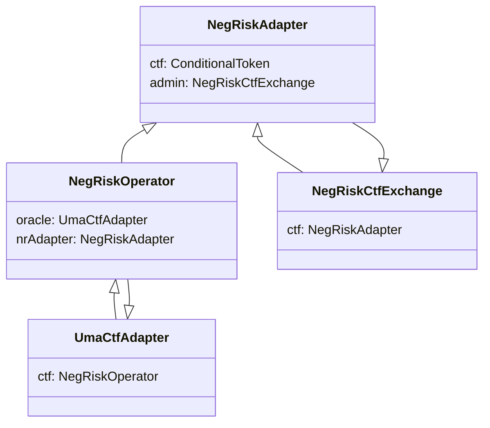
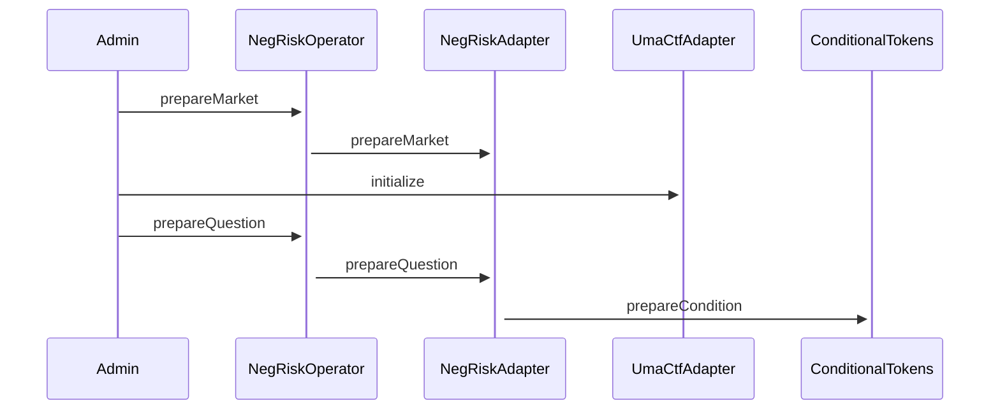
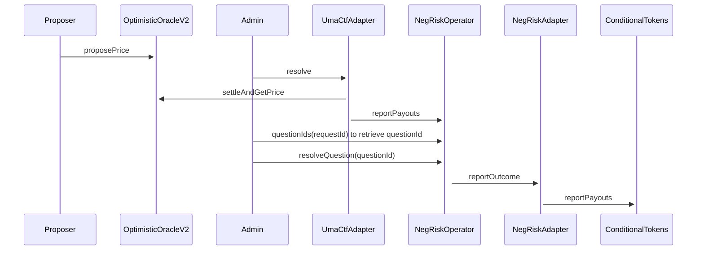
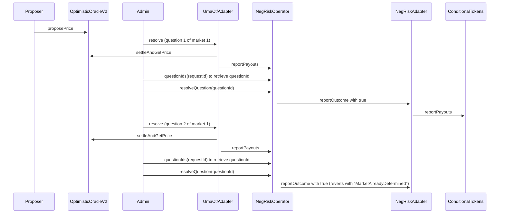

# Neg Risk

The simplest type of market is a question with a binary outcome such as "Will Donald Trump win the presidential election in 2028". There exists a more complex market type called **Neg Risk** on Polymarket. Neg Risk refers to a group of binary markets that are mutually exclusive (The true meaning is NO shares can be converted to YES shares of other options, but it's commonly understood to be winner takes all markets). If one question resolves to YES, all related questions must resolve to NO. The most relevant example is the Presidential Election Winner market. There can only be one winner.

<figure><figcaption></figcaption></figure>

Under the hood there is one UMA price request per candidate. [Donald Trump](https://oracle.uma.xyz/settled?project=Polymarket\&transactionHash=0xe687e360f4f6fc94a79e2dc9cf27e4db9bee101a07d4bd612a3c292200fbb8e4\&eventIndex=4294967293) and [Joe Biden](https://oracle.uma.xyz/settled?project=Polymarket\&transactionHash=0xa7f804560a2ce5363b84e5d0a0c0c4df9b2601d6699a6632f0fe6c26e51cab6b\&eventIndex=4294967293) each has his own UMA resolution. UMA is not aware of the connectivity among these questions. Polymarket has created a custom architecture to link them together.

#### Terminologies

**Market**: A market connects UMA price requests. Each UMA price request is separate and is not aware of the presence of other price requests, a market creates connections among them as well as dependencies.

**Question ID**: A question ID is a question under a market. It shares the same prefix with other question ID under the same market with an incremental suffix.

**Request ID**: A request ID refers to the UMA question ID. It is easy to confuse this with the question ID because in binary markets the UMA question ID is just called the question ID.

#### Workflow

Neg Risk's workflow is quite confusing because certain contract `address` variables do not point to the contracts you expect in order to enable mutual exclusivity (For example, NegRiskCtfExchange's CTF is the NegRiskAdapter). I have prepared some charts to better visualize the workflow.

**Dependencies**



**Create a neg risk market and questions**



**Settling a market**



**Settling a question to YES, but the market already has another question resolved to YES**



#### Creating a Neg Risk Market

The admin calls `NegRiskOperator`'s [prepareMarket](https://github.com/Polymarket/neg-risk-ctf-adapter/blob/main/src/NegRiskOperator.sol#L97) to create a market. Internally it calls `NegRiskAdapter`'s [prepareMarket](https://github.com/Polymarket/neg-risk-ctf-adapter/blob/e206dd2ed5aa24cf1f86990b875c6b1577be25e2/src/modules/MarketDataManager.sol#L59).

Each market has a unique identifier. The identifier is a keccak256 hash of the `oracle` (The NegRiskOperator), feeBips (**This is the fee for converting positions and not the trading fee, but it's set to 0**) and \_metadata (it can be an empty string).

```solidity
keccak256(abi.encode(_oracle, _feeBips, _metadata)) & MASK
```

The MASK is

```solidity
bytes32(type(uint256).max) << 8
```

which is equal to `0xffffffffffffffffffffffffffffffffffffffffffffffffffffffffffffff00`. The last byte is zeroed out by shifting `0xffffffffffffffffffffffffffffffffffffffffffffffffffffffffffffffff` by 1 byte. The reason for doing that is to create questions under a market whose prefix is the market ID and the last byte is reserved as the question's index under the market.

```solidity
function getQuestionId(bytes32 _marketId, uint8 _questionIndex) internal pure returns (bytes32) {
    unchecked {
        return bytes32(uint256(_marketId) + _questionIndex);
    }
}
```

`_questionIndex` is a `uint8`, so a market can have a maximum of 256 questions from index 0 to 255 (We can't have a presidential election with 257 candidates :cry:).

The market's data is stored in the `marketData` mapping.

```solidity
marketData[marketId] = MarketDataLib.initialize(oracle, _feeBips);
```

`marketData` is a packed `bytes32` storage that stores the market's `questionCount`, `determined` (whether there is a question that resolved to YES), `result` (the question index that resolved to YES), `feeBips` and `oracle`.

```
// md[0] = questionCount
// md[1] = determined
// md[2] = result
// md[3:4] = feeBips
// md[12:32] = oracle
```

#### Creating a Question

Creating a question is the same as creating a UMA price request for non neg risk markets. A neg risk question is fundamentally the same concept. Again, from the POV of a UMA price proposer/disputer, there isn't a piece of data that says the question is "neg risk".

> **It is important to note that for a non neg risk question, the UMA price request ID is called `questionID`, but the same questionID is called `requestID` (oracle request ID, with the oracle being UMA) in neg risk markets because NegRiskOperator also has its own index based question IDs under each market.**

After creating an UMA price request, we take the `questionID` to the `NegRiskOperator` and call `prepareQuestion`. It calls `NegRiskAdapter`'s [prepareQuestion](https://github.com/Polymarket/neg-risk-ctf-adapter/blob/e206dd2ed5aa24cf1f86990b875c6b1577be25e2/src/modules/MarketDataManager.sol#L74) internally.

The question ID for the UMA price request is based on the current number of questions in the market. If there are currently 0 questions, then the question index is 0. If there is 1 question, then the question index is 1, etc. **Again**, the prefix of the question ID is the market ID of the market that the question belongs to.

```solidity
questionId = NegRiskIdLib.getQuestionId(_marketId, uint8(index));
```

Since there is a new question, the adapter increments the market's question count (`INCREMENT` is 1 in hexadecimal format).

```solidity
function incrementQuestionCount(MarketData _data) internal pure returns (MarketData) {
    bytes32 data = MarketData.unwrap(_data);
    data = bytes32(uint256(data) + INCREMENT);
    return MarketData.wrap(data);
}
```

NegRiskAdapter then prepares the condition at the CTF contract.

> **The question ID it uses to generate a CTF condition ID for neg risk markets is an internal question ID and the question ID it uses to generate a CTF condition ID for non neg risk markets is a question ID from UMA.**

```solidity
(bytes32 questionId, uint256 questionIndex) = _prepareQuestion(_marketId);
bytes32 conditionId = getConditionId(questionId);

// check to see if the condition has already been prepared on the ctf
if (ctf.getOutcomeSlotCount(conditionId) == 0) {
    ctf.prepareCondition(address(this), questionId, 2);
}
```

At last NegRiskOperator links the internal question ID to the UMA price request ID. The linkage is useful for result resolution later.

```solidity
bytes32 questionId = nrAdapter.prepareQuestion(_marketId, _data);

questionIds[_requestId] = questionId;
```

#### Resolving a Question

Resolving a question in a neg risk market is the same as in a binary market as they are still UMA questions. It starts with a price proposal to the Optimistic Oracle and then calling `UmaCtfAdapter`'s `resolve`. Remember that the neg risk UMA CTF adapter's CTF is actually the neg risk operator, so when the UMA CTF adapter calls

```solidity
ctf.reportPayouts(questionID, payouts);
```

it is actually calling `NegRiskOperator`'s `reportPayouts` instead of the real CTF. This function is only callable by the UMA CTF adapter as it acts as the oracle.

`NegRiskOperator` records the question's result as well as the time when the answer is reported.

```solidity
function reportPayouts(bytes32 _requestId, uint256[] calldata _payouts) external onlyOracle {
    if (_payouts.length != 2) {
        revert InvalidPayouts();
    }

    uint256 payout0 = _payouts[0];
    uint256 payout1 = _payouts[1];

    if (payout0 + payout1 != 1) {
        revert InvalidPayouts();
    }

    bytes32 questionId = questionIds[_requestId];

    if (questionId == bytes32(0)) {
        revert InvalidRequestId();
    }

    if (reportedAt[questionId] > 0) {
        revert QuestionAlreadyReported();
    }

    bool result = payout0 == 1 ? true : false;

    results[questionId] = result;
    reportedAt[questionId] = block.timestamp;

    emit QuestionReported(questionId, _requestId, result);
}
```

After the payout is reported, the function `resolveQuestion` can be called to report the recorded outcome. Again, the question ID is **NOT** the UMA question ID but the question ID under the market.

```solidity
function resolveQuestion(bytes32 _questionId) external onlyNotFlagged(_questionId) {
    uint256 reportedAt_ = reportedAt[_questionId];

    if (reportedAt_ == 0) revert ResultNotAvailable();
    if (block.timestamp < reportedAt_ + DELAY_PERIOD) {
        revert DelayPeriodNotOver();
    }

    bool result = results[_questionId];
    nrAdapter.reportOutcome(_questionId, result);

    emit QuestionResolved(_questionId, result);
}
```

Neg risk operator calls neg risk adapter's `reportOutcome`, which ensures the outcome `true` can only be reported once. If the question resolves to true for the first time, it sets the `determined` bit in the market data `bytes32` so that subsequent question resolution can **NOT** be resolved to true.

```solidity
function _reportOutcome(bytes32 _questionId, bool _outcome) internal {
    bytes32 marketId = NegRiskIdLib.getMarketId(_questionId);
    uint256 questionIndex = NegRiskIdLib.getQuestionIndex(_questionId);

    MarketData data = marketData[marketId];
    address oracle = data.oracle();

    if (oracle == address(0)) revert MarketNotPrepared();
    if (oracle != msg.sender) revert OnlyOracle();
    if (questionIndex >= data.questionCount()) revert IndexOutOfBounds();

    if (_outcome == true) {
        if (data.determined()) revert MarketAlreadyDetermined();
        marketData[marketId] = data.determine(questionIndex);
    }
}
```

After reporting the outcome, neg risk adapter calls `ctf.reportPayouts`, this time with `ctf` being the real CTF contract, which means winners of the particular market can now redeem their positions.

```solidity
ctf.reportPayouts(questionID, payouts);
```

The logic can be hard to follow, but essentially what Polymarket does is to connect UMA price requests under one market, use neg risk operator to store results from UMA and send the results to neg risk adapter which uses its internal market data logic to make sure only 1 of the market's questions can be resolved to true, achieving "winner takes all".
